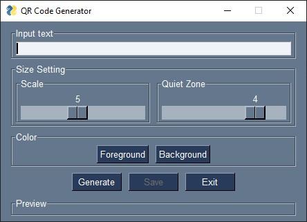
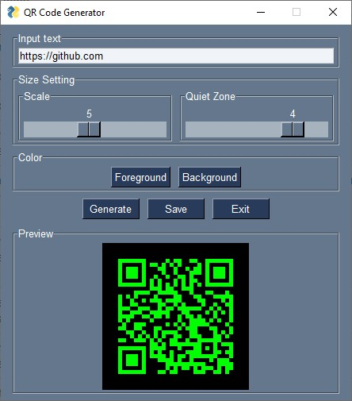

# QRGUI

## Overview
This repository contains a Python project which creates a GUI to generate a QR code based on the text entered in the input field. The user has the options to change the size, foreground and background color of the QR code.  

This project is originally using `PySimpleGUI`, now migrated to `FreeSimpleGUI`. The environment and dependencies are now managed using [`uv`](https://github.com/astral-sh/uv), a modern and fast Python package manager.

---

## Getting Started

Follow these instructions to set up and run the project using `uv`.

### Prerequisites

- **Python 3.12 or higher** must be installed on your system. You can download it from [https://www.python.org/downloads/](https://www.python.org/downloads/).
- Install `uv` by following the instructions from the official GitHub page:  
  [https://github.com/astral-sh/uv#installation](https://github.com/astral-sh/uv#installation)

#### Install `uv`

- **Linux/macOS**:
  ```bash
  curl -LsSf https://astral.sh/uv/install.sh | sh
  ```

- **Windows (PowerShell)**:
  ```powershell
  irm https://astral.sh/uv/install.ps1 | iex
  ```

---

## Running the Project

### 1. Clone the Repository

```bash
git clone https://github.com/wooihaw/qrgui.git
cd qrgui
```

### 2. Run the Application

```bash
uv run qrgui.py
```

This command will:

- Automatically create a virtual environment in `.venv` if it doesn't exist
- Install all dependencies from `pyproject.toml` (and `uv.lock` if present)
- Run the script inside the virtual environment

---

## Screenshot



