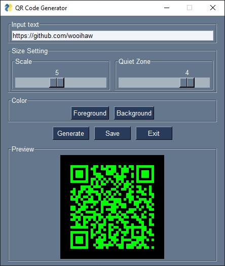

# Table of Contents <!-- omit in toc -->
- [1. Introduction](#1-introduction)
- [2. Preparing to run the sample codes](#2-preparing-to-run-the-sample-codes)
  - [2.1. Create virtual environment with Conda](#21-create-virtual-environment-with-conda)
  - [2.2. Create virtual environment with Python venv](#22-create-virtual-environment-with-python-venv)
- [3. Launch the Python script](#3-launch-the-python-script)
- [4. Screenshot](#4-screenshot)

# 1. Introduction
1. This repository contains a Python GUI program to generate a QR code based on the text entered in the input field. 
2. The user has the options to change the size, foreground and background color of the QR code.

# 2. Preparing to run the sample codes
1. Clone this repository or download the repository as a zip file.
2. If the repository is downloaded as a zip file, extract the zip file into its own folder.
3. Follow one of the methods below to create a virtual environment.

## 2.1. Create virtual environment with Conda
1. Follow this method if you have installed Anaconda.
2. Launch Anaconda Prompt.
3. Create a cirtual environment called py4iot with Python 3.9:
   - conda create -n qrgui python=3.9
4. After the virtual environment is created, activate it:
   - conda activate qrgui
5. Change to the folder with the extracted repository.
6. Install the required Python modules and packages:
   - python -m pip install pysimplegui pypng pyqrcode
7. To deactivate the virtual environment:
   - conda deactivate

## 2.2. Create virtual environment with Python venv
1. Launch a terminal/command prompt.
2. Change to the folder with the extracted repository.
3. Create a virtual environment:
    - python -m venv env
4. Once the virtual environment has been created, there will be a folder called "env" in the current folder.
5. To activate the virtual environment in Windows:
   - cd env\Scripts
   - activate
   - cd ..\\..
6. To activate the virtual environment in Linux:
   - souce env/bin/activate
7. Install the required Python modules and packages:
   - python -m pip install pysimplegui pypng pyqrcode
8. To deactivate the virtual environment in Windows or Linux:
   - deactivate
  
# 3. Launch the Python script
1. Launch a terminal/command prompt/Anaconda prompt.
2. Change to the folder of the extracted repository and activate the virtual environment (if virtual environment was created).
3. Enter the following command to launch the GUI:
   - python qrgui.py

# 4. Screenshot

